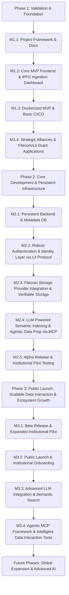

# MemoryChain: Hyper-Detailed Roadmap - Strategic Alignment with Filecoin & IPFS

This roadmap provides an in-depth look at the phases, milestones, and key decision points for the MemoryChain project. It is a living document, subject to refinement as we gather more insights, conduct further research, and receive feedback. Our primary focus is to build a platform that not only leverages but actively promotes the core tenets and capabilities of the Filecoin and IPFS ecosystems.

## Core Principles Guiding the Roadmap:

*   **Decentralized Data Permanence:** Championing IPFS for content-addressing and Filecoin for verifiable, long-term, and incentivized data storage, ensuring historical truth is immutable and censorship-resistant.
*   **Public Utility & Accessibility:** Designing for broad accessibility and utility, particularly for institutional and governmental bodies, to create a public good for historical and verifiable data.
*   **Intelligent Data Interaction via Model Context Protocol (MCP):** Leveraging AI and LLMs, orchestrated through the Model Context Protocol (MCP), to transform raw IPFS data into semantically rich, discoverable, and interactive knowledge. This enhances the value of stored information by enabling LLMs to dynamically access and process external data and tools.
*   **Scalable & Interoperable Infrastructure:** Building a modular and extensible architecture that can scale from individual institutions to a global network, integrating seamlessly with existing and emerging Web3 standards.
*   **Verifiable Trust & Authenticity:** Implementing robust mechanisms for data provenance, integrity, and credential verification, fostering trust in digital records.
*   **Agentic Framework for Ecosystem Integration:** Developing and deploying AI agents that utilize MCP to actively interact with IPFS data, manage specialized data services (Micro-Content Providers or similar), and intelligently navigate the decentralized data ecosystem, promoting scalable storage services and fostering a dynamic data economy.
*   **UI/UX as a Cornerstone:** Prioritizing intuitive, engaging, and accessible user interfaces and experiences at every stage of development, ensuring seamless interaction with complex decentralized and AI-driven functionalities.
*   **Open Source & Community Contribution:** Committing to open-source development, releasing SDKs and tools to foster community engagement, drive adoption, and build brand awareness within the Web3 ecosystem.

---

## Roadmap Overview (Mermaid Diagram)

---

## Phase 1: Validation & Foundation (Months 1-4)

**Goal:** To validate the core concepts, establish foundational partnerships, secure initial funding, and build a demonstrable MVP that showcases the power of IPFS and LLM-driven metadata.

### Milestones:

*   **M1.1: Project Framework & Documentation Complete (Month 1)**
    *   **Deliverables:** `00_Project_Framework/` (Charter, Vision, Tech Stack, Roadmap, Technical Architecture Summary), `01_MVP/` (Definition, User Stories), `02_Agents/` (Agent Culture, PM/Architect Manual), `Devlogs.md`, `README.md`, `.gitignore`.
    *   **Decision Point:** Finalize initial project scope and core principles, ensuring strong alignment with Filecoin Foundation goals.
*   **M1.2: Core MVP Frontend & IPFS Ingestion Dashboard (Month 2)**
    *   **Deliverables:** Functional React application with:
        *   Basic routing (`/`, `/login`, `/admin`, `/verify`).
        *   Simulated authentication (`AuthContext`, `LoginPage`, `ProtectedRoute`).
        *   **Institutional Ingestion Dashboard:** User-friendly interface for designated institutional users to upload digital assets (documents, images). **UI/UX Focus:** Intuitive drag-and-drop, clear progress indicators, accessible design.
        *   **Automated CID Generation:** Upon upload, the system generates a unique IPFS Content Identifier (CID).
        *   **LLM-Assisted Metadata Generation:** Initial integration of an LLM to suggest and enrich metadata (Title, Author, Date, Description, Keywords) based on uploaded content, setting the cornerstone for intelligent data interaction.
        *   Metadata stored in-memory (placeholder for future database).
        *   Display of uploaded assets with IPFS CIDs and public gateway links.
        *   Verification Page to retrieve asset metadata by CID.
    *   **Decision Point:** Confirm user flow for institutional data ingestion, CID generation, and LLM-assisted metadata.
*   **M1.3: Dockerized MVP & Basic CI/CD (Month 3)**
    *   **Deliverables:** `Dockerfile`, `.dockerignore`, Docker build/run scripts in `package.json`. Basic CI/CD pipeline (e.g., GitHub Actions) for automated Docker image builds on push to main branch.
    *   **Decision Point:** Select initial CI/CD platform and define basic deployment strategy for containerized frontend.
*   **M1.4: Strategic Alliances & Filecoin/Lit Grant Applications (Month 4)**
    *   **Deliverables:** Formalized discussions with an Identity & Attestation Layer Provider. Comprehensive Filecoin Foundation grant application submitted, highlighting MemoryChain's contribution to the Filecoin ecosystem. **Lit Protocol Grant Application submitted for "Credentialing SDK" (#4)**, emphasizing MemoryChain's use case for verifiable credentials and **"Generating Privacy-Preserving Proofs with Lit" (#6)**, highlighting its alignment with secure off-chain data verification. Pilot plan with initial institutional partner (e.g., CNMH) finalized.
    *   **Decision Point:** Go/No-Go for full-scale development based on funding and strategic alliance progress.

### Key Activities:

*   **Project Management:** Regular stand-ups, sprint planning, stakeholder communication, with a focus on transparent progress reporting.
*   **UX/UI Design:** Wireframing and mockups for the institutional ingestion dashboard, emphasizing user-friendliness and clear workflows. **Deliverable:** High-fidelity mockups and user flow diagrams.
*   **Technical Architecture:** Detailed design of frontend components, API interfaces (for future backend), and IPFS interaction patterns, with a strong emphasis on Filecoin integration points.
*   **Research & Development (Authentication & Identity Layer):**
    *   **Task:** Deep dive into Lit Protocol's decentralized access control, key management (PKPs), and potential for integration with NFTs for identity and fine-grained data access.
    *   **Task:** Analyze Lit Protocol's "Credentialing SDK" (#4) and "Generating Privacy-Preserving Proofs with Lit" (#6) grants for direct applicability and integration into MemoryChain's authentication and data verification strategy.
    *   **Deliverable:** Comparative analysis document on Lit Protocol's capabilities for authentication and verifiable attestations, outlining pros, cons, and integration complexity, specifically for institutional use cases.
    *   **Decision Point:** Formalize Lit Protocol as the primary authentication and verifiable credential issuance strategy for Phase 2.
*   **Research & Development (Model Context Protocol (MCP) & Agentic Framework for Data Interaction):**
    *   **Task:** Research existing agentic frameworks (e.g., Flowise, LangChain agents) and their potential for interacting with IPFS data, generating metadata, and preparing data for MCPs.
    *   **Task:** Deep dive into the Model Context Protocol (MCP) specification and existing implementations to understand how LLMs can dynamically discover and utilize tools/services (MCP servers) to process IPFS-stored content.
    *   **Deliverable:** A preliminary report on MCP suitability, agentic framework integration strategy, and potential for developing custom MCP servers for MemoryChain's specific data interaction needs.
*   **Community Engagement:** Initial outreach to Filecoin ecosystem, Lit Protocol community, potential institutional partners, and early adopters, showcasing the MVP's IPFS and LLM capabilities.

---

## Phase 2: Core Development & Persistent Infrastructure (Months 5-12)

**Goal:** To build the persistent backend infrastructure, integrate a robust and verifiable authentication system via Lit Protocol, and enhance the MVP with core features for data indexing and LLM-driven agentic interaction via MCP.

### Milestones:

*   **M2.1: Persistent Backend & Metadata Database (Month 6)**
    *   **Deliverables:** Node.js/Express.js backend API. PostgreSQL database for metadata (Title, Author, Date, Description, CID, LLM-generated tags/summaries). Initial data models for assets, institutional users, and verifiable credentials.
    *   **Decision Point:** Finalize backend framework and database choices, ensuring scalability for large institutional datasets.
*   **M2.2: Robust Authentication & Identity Layer via Lit Protocol (Month 8)**
    *   **Deliverables:** Fully functional authentication system implemented using **Lit Protocol's Programmable Key Pairs (PKPs)**. Secure institutional user registration and login. Role-based access control for the Ingestion Dashboard. Integration with Lit Protocol for user identity and condition-based access. **UI/UX Focus:** Seamless and secure login/registration flows, clear indication of Lit Protocol integration. **Open Source Deliverable:** Release a basic Lit Protocol integration SDK for React applications, potentially leveraging the "Credentialing SDK" grant.
    *   **Decision Point:** Finalize Lit Protocol implementation details, ensuring compliance with institutional security standards and leveraging Lit Actions for advanced access control.
*   **M2.3: Filecoin Storage Provider Integration & Verifiable Storage (Month 9)**
    *   **Deliverables:** Integration with a Filecoin Storage Provider (FSP) or a Filecoin-native pinning service to ensure long-term, verifiable data persistence. Implementation of storage deals for uploaded CIDs. Monitoring of storage deal status. **UI/UX Focus:** Clear feedback on storage deal status within the Admin Dashboard. **Open Source Deliverable:** Publish a Filecoin storage deal client library.
    *   **Decision Point:** Select preferred FSP(s) and define storage deal parameters (e.g., replication factor, deal duration).
*   **M2.4: LLM-Powered Semantic Indexing & Agentic Data Preparation via MCP (Month 11)**
    *   **Deliverables:** Integration of a vector database (e.g., Pinecone, Weaviate) to store embeddings of asset metadata and content. Development of initial AI agents that utilize MCP to process IPFS data, refine metadata, perform data quality assurance, and prepare datasets for potential specialized data services (e.g., Micro-Content Providers). API endpoints for semantic search queries. **UI/UX Focus:** Visualization of LLM-generated metadata and agent activity. **Open Source Deliverable:** Release a basic MCP client library for LLM interaction with IPFS data.
    *   **Decision Point:** Select vector database and initial LLM models for embedding generation and define agentic data preparation workflows via MCP.
*   **M2.5: Alpha Release & Institutional Pilot Testing (Month 12)**
    *   **Deliverables:** Feature-complete Alpha version of the platform with persistent storage, Lit Protocol authentication, basic semantic search, and tested agentic data preparation workflows via MCP. Comprehensive internal testing and pilot testing with initial institutional partners (e.g., CNMH). **UI/UX Focus:** Gather user feedback on all new features and workflows.

### Key Activities:

*   **Backend Development:** API endpoints for asset management (CRUD), institutional user management, authentication (Lit Protocol integration), and Filecoin storage deal management.
*   **Database Design:** Schema definition, indexing strategies for both traditional and vector databases.
*   **Smart Contract Development:** Explore using Lit Actions for condition-based signing related to verifiable credentials and NFTs, aligning with the "Credentialing SDK" grant.
*   **Frontend Refinement:** Connect frontend to new backend APIs. Improve UI/UX based on initial feedback from institutional users.
*   **Security Audits:** Conduct preliminary security reviews of the backend, smart contracts, and Lit Protocol integration.
*   **Documentation:** Update API documentation, technical specifications, and user guides for institutional partners.
*   **AI Agent Development & MCP Integration:** Develop and train AI agents that leverage the Model Context Protocol (MCP) for tasks like:
    *   Automated metadata refinement and enrichment from IPFS content.
    *   Data quality assurance and validation.
    *   Pre-processing datasets for specialized data services (e.g., Micro-Content Providers).
    *   Initial exploration of agent-driven data curation and content summarization.
    *   **Task:** Develop initial MCP servers or clients to enable LLMs to interact with MemoryChain's IPFS data and metadata services.
*   **Research & Development (Specialized Data Services & Agentic Interaction):**
    *   **Task:** Investigate the feasibility of creating specialized data services (e.g., Micro-Content Providers) for specific institutional datasets, and how MCP can facilitate LLM interaction with these services.
    *   **Task:** Explore the design of agent-driven mechanisms for the creation, management, and intelligent interaction with these specialized data services.
    *   **Task:** Research the design of an "Index of Specialized Data Services" (or "Index of MCPs") that considers the intersection of Blockchain, Machine Learning, IPFS, IoT, AI, and agentic frameworks, enabling discovery and interaction with specialized data archives.
    *   **Deliverable:** Feasibility report and preliminary design for agent-assisted specialized data service integration and an "Index of MCPs."

---

## Phase 3: Public Launch, Scalable Data Interaction & Ecosystem Growth (Months 13-18)

**Goal:** To launch the platform to the public, onboard initial institutional partners, and establish MemoryChain as a leading platform for verifiable, LLM-indexed, and Filecoin-backed data, driven by intelligent agents and the Model Context Protocol.

### Milestones:

*   **M3.1: Beta Release & Expanded Institutional Pilot (Month 14)**
    *   **Deliverables:** Beta version deployed to a staging environment. Expanded pilot program with CNMH and 1-2 additional institutions actively using the platform. **UI/UX Focus:** Refine workflows based on extensive user testing.
    *   **Decision Point:** Gather feedback from expanded pilot partners and prioritize final adjustments for public launch.
*   **M3.2: Public Launch & Institutional Onboarding (Month 15)**
    *   **Deliverables:** Production deployment of MemoryChain. Public announcement and marketing campaign targeting institutions and governmental bodies. Initial institutional partners fully onboarded and actively archiving data. **UI/UX Focus:** Polished, production-ready interfaces.
    *   **Decision Point:** Final readiness check for public launch and institutional adoption.
*   **M3.3: Advanced LLM Integration & Semantic Search (Month 16)**
    *   **Deliverables:** Enhanced LLM pipeline for more sophisticated metadata generation (e.g., summarization, entity extraction). Fully functional semantic search interface for institutional users and potentially public access, leveraging MCP for LLM interaction. **UI/UX Focus:** Intuitive search experience, clear presentation of search results and LLM insights.
    *   **Decision Point:** Evaluate performance and accuracy of LLM integrations and MCP-driven search.
*   **M3.4: Agentic MCP Framework & Intelligent Data Interaction Tools (Month 18)**
    *   **Deliverables:** A functional framework for agent-assisted creation and management of specialized data services (MCPs). Tools for semantic querying and intelligent interaction with data across these MCPs, leveraging an "Index of MCPs" driven by AI agents. Promotion of storage providing services with scalable models through these agentic frameworks. **UI/UX Focus:** Dashboards for MCP management, clear interfaces for agent interaction. **Open Source Deliverable:** Release an SDK for generating privacy-preserving proofs over off-chain data using Lit Protocol, aligning with grant #6.
    *   **Decision Point:** Evaluate initial MCP framework adoption and plan for further development of agentic capabilities.

### Key Activities:

*   **Deployment & Operations:** Monitor production environment, implement robust logging, alerting, and scaling strategies.
*   **User Support:** Establish dedicated support channels for institutional partners.
*   **Marketing & Outreach:** Promote the platform to target institutional and governmental audiences, highlighting Filecoin integration, LLM capabilities, and the innovative agentic data interaction via MCP.
*   **Feature Prioritization:** Based on institutional feedback and market demand, prioritize features for future development (e.g., advanced whitelabeling, NFT-based access control, deeper AI integrations).
*   **Advanced AI Agent Development**: Focus on agents that utilize MCP for:
    *   Automated specialized data service (MCP) discovery and indexing.
    *   Cross-MCP data correlation and analysis.
    *   Agent-driven data governance and access control.
    *   Optimizing data placement and retrieval across the Filecoin network.
*   **"Index of MCPs" Development**: Detail the development of this index as an intelligent, agent-driven system that maps and categorizes specialized data services (MCPs) based on their data, quality, and services, considering the intersection of Blockchain, Machine Learning, IPFS, IoT, AI, and agentic frameworks.
*   **Research & Development (Ecosystem Integration):**
    *   **Task:** Explore deeper integration with the Filecoin Virtual Machine (FVM) for smart contract logic related to data governance and agent-managed MCPs.
    *   **Task:** Investigate integration with other decentralized identity solutions for enhanced institutional verification.
    *   **Task:** Continue exploring the intersection of IPFS, Blockchain, Machine Learning, IoT, AI, and agentic frameworks for creating a truly intelligent and interconnected data ecosystem.
    *   **Task:** Explore Lit Protocol's "Multichain Decentralized Communication" (#11) for secure, decentralized communication within the MemoryChain ecosystem.

---

## Future Phases (Beyond 18 Months)

*   **Global Expansion & Multi-Institutional Network:** Expand to a global network of institutions and governments, fostering cross-organizational data sharing and verification, facilitated by autonomous agents and MCPs.
*   **Advanced AI Agents for Curation, Analysis & Autonomous MCPs:** Develop sophisticated AI agents that can autonomously manage MCPs, perform complex data analysis, participate in decentralized governance, and proactively curate valuable datasets, all orchestrated via MCP.
*   **NFT-based Data Governance & Monetization:** Implement robust NFT frameworks for data ownership, access control, and potential monetization models for curated datasets, with agents facilitating transactions and rights management through MCP.
*   **Decentralized Autonomous Organizations (DAOs) for Data Stewardship:** Explore DAO models for community-driven governance and stewardship of historical and public data, with AI agents and MCPs playing a key role in decision-making and execution.
*   **Space Applications & Communications:** Research and develop solutions for data storage, communication, and verifiable record-keeping in off-world environments, leveraging the resilience of IPFS/Filecoin and intelligent agent networks (MCPs) for data relay and processing. **Potential Lit Protocol Integration:** Explore "Multichain Decentralized Communication" (#11) for secure, off-world data exchange.

---

## Versioning Plan

*   **v0.1 (Month 3):** Functional MVP with basic IPFS upload, LLM-assisted metadata (in-memory), and simulated authentication. (Current State)
*   **v0.5 (Month 8):** Alpha release with persistent backend, robust institutional authentication via Lit Protocol, and Filecoin Storage Provider integration.
*   **v0.8 (Month 11):** Beta release with Lit Protocol-powered Verifiable Credential issuance for assets, initial semantic search capabilities, and agentic data preparation workflows via MCP.
*   **v1.0 (Month 15):** Public launch with initial institutional partners, advanced LLM integration, and foundational agent-assisted MCP framework, including open-source SDKs for Lit Protocol integration.
*   **v1.x (Ongoing):** Iterative releases with new features, improvements, and expansions, driven by institutional needs, ecosystem advancements, and evolving agentic capabilities.

---

**Decision Log:** All major architectural and strategic decisions will be documented in the `Devlogs.md` and relevant project framework documents, ensuring traceability and continuous learning within our agentic framework.

